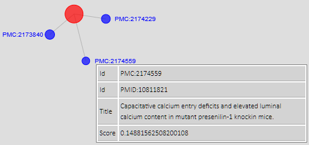

# biotea-vis-similarity
A BioJS component to visualize Biotea semantic similarities. This component is used 
in [Biolinks project](http://ljgarcia.github.io/biotea-biolinks).

There are two **local** dependencies to 
https://github.com/ljgarcia/biotea-io-parser and https://github.com/ljgarcia/biotea-vis-tooltip. 
You will need to download it and install it as a node-module for biote-vis-annotation to work.
